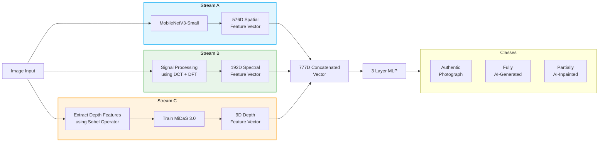

<h1 align="center">🖼️ MDIF: A Multi-Domain Inconsistency Framework for Image Forgery Detection</h1>

<p align="center">
    
</p>

---

## Architecture

The MDIF Framework is uh... yea... :pray:



---

## Datasets Used

> [!NOTE]
> Refer to the [`readme`](./data/README.md) in the `data/*` directory for how to set up the datasets!

| Dataset                                                                                          | Type               |
| :----------------------------------------------------------------------------------------------- | :----------------- |
| [CIFAKE](https://www.kaggle.com/datasets/birdy654/cifake-real-and-ai-generated-synthetic-images) | SD v1.4 + CIFAR-10 |
| [Unbiased Tiny GenImage](https://www.kaggle.com/datasets/cartografia/unbiased-tiny-genimage)     | Midjourney, glide  |
| [AutoSplice](https://github.com/shanface33/AutoSplice_Dataset/tree/main)                         | DALL-E 2 Inpainted |
| [CocoGlide](https://github.com/grip-unina/TruFor)                                                | GLIDE Inpainted    |

---

## Getting Started

Firstly, clone this repo,

<!-- ```bash
git clone https://github.com/joejo-joestar/anti-poojinator-3000.git
cd anti-poojinator-3000
``` -->

```bash
git clone https://github.com/joejo-joestar/MDIF.git
cd MDIF
```

Then install Miniconda from [the Anaconda Website](https://docs.anaconda.com/miniconda/install).

> [!NOTE]
> The notebooks **running locally** assumes you are using a conda environment!

Then open a command prompt, and run the following. This will create and activate a `python 3.11` environment called `mdif`. The [environment.yml](./environment.yml) will be used to create the environment and install all needed dependencies.

```bash
conda env create
```

```bash
conda activate mdif
```

After running this, your CMD prompt should have a "`(mdif)`" prefixed at the start.

Then install the `mdif/*` directory as an [editable package](https://stackoverflow.com/questions/714063/importing-modules-from-parent-folder/50194143#50194143)

```bash
pip install -e .
```

And now you can check out the [`mdif.ipynb`](./mdif.ipynb) notebook to see how the framework works!

> [!TIP]
> To **deactivate** the environment, simply run:
>
> ```bash
> conda deactivate
> ```
>
> To **remove** the environment completely, run:
>
> ```bash
> conda env remove -n mdif
> ```

<br/>

> [!NOTE]
> Remember to select `mdif` as the kernel for all the notebooks!

---

## Acknowledgments

This work is builds on and uses Intel ISL's [MiDaS](https://pytorch.org/hub/intelisl_midas_v2) and Qualcomm's [MobileNet V3 Small](https://docs.pytorch.org/vision/main/models/generated/torchvision.models.mobilenet_v3_small.html) model.

The framework has been fine-tuned and trained on the [AutoSplice](https://github.com/shanface33/AutoSplice_Dataset/tree/main), [CIFAKE](https://www.kaggle.com/datasets/birdy654/cifake-real-and-ai-generated-synthetic-images), [CocoGlide](https://github.com/grip-unina/TruFor), and [Unbiased Tiny GenImage](https://www.kaggle.com/datasets/cartografia/unbiased-tiny-genimage) datasets.

The sample images [`sample/real_flower2`](sample/real_flower2.jpg) and [`sample/real_cat`](sample/real_cat.jpg) are Photos by [joejo joestar](https://unsplash.com/@joejojoestar?utm_source=unsplash&utm_medium=referral&utm_content=creditCopyText) on [Unsplash](https://unsplash.com/photos/3qg-RiNOnHQ?utm_source=unsplash&utm_medium=referral&utm_content=creditCopyText) and the [`sample/gen_nanoban_flower`](sample/gen_nanoban_flower.jpg) and [`sample/gen_nanoban_cat`](sample/gen_nanoban_cat.jpg) are generated using [Google's Nano Banana (Gemini 2.5 Flash Image)](https://ai.google.dev/gemini-api/docs/models/gemini-2.5-flash-image)

---

## Authors

| ID No.        | Name                                              |
| :------------ | :------------------------------------------------ |
| 2022A7PS0019U | [Joseph Cijo](https://github.com/joejo-joestar)   |
| 2022A7PS0077U | [Adithya Sunoj](https://github.com/adithya-sunoj) |
| 2022A7PS0140U | [Akamksha Ranil](https://github.com/aksran31)     |

---
